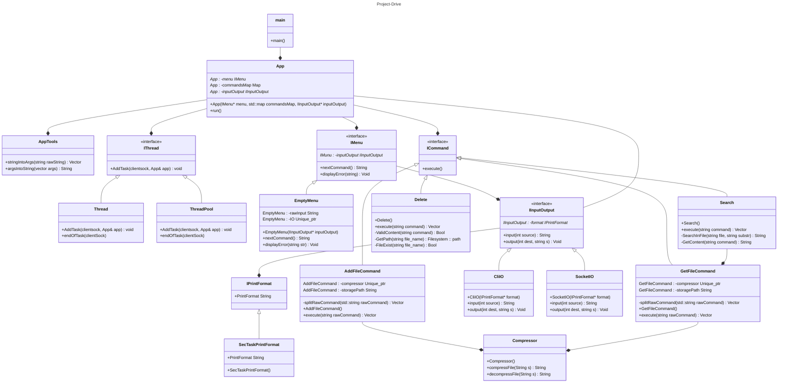

# c++ TCP file server

This is a component part of the Drive.

The file server is a docker-compose service.
and so need to be run through docker-compose.

## running the files server:

to run the Server (service "files-server"):

1. git clone this repository.
2. make sure you are in "project-drive" directory.
3. run `docker-compose up files-server`

the `up` command will not allow you to interact with the files-server via the terminal. (unless attached).
but if you require it, the command `run` will run it with terminal IO
but the service that way will not serve the clients.

## tests for the file server:

This component was developed with TDD. with the GTEST library.
and so if you want to run the tests yourself you can.

### running tests for files-server:

to test the files-server:

1. make sure you are in "project-drive" dir
2. run `docker-compose run gtest`

> running docker build in the /test folder wont work. test only by docker-compos in the root project folder.

#### tests example

running the Server tests with `docker-compose run gtest`:

## code structure UML for the files-server:

this diagrem is the current structure of the app classes

